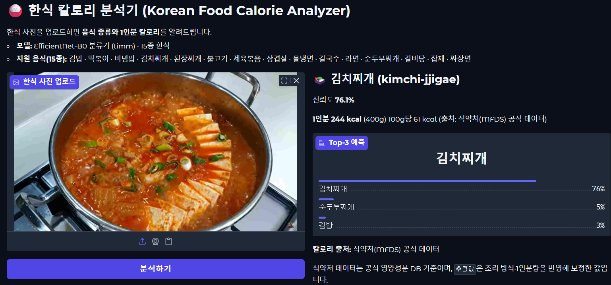
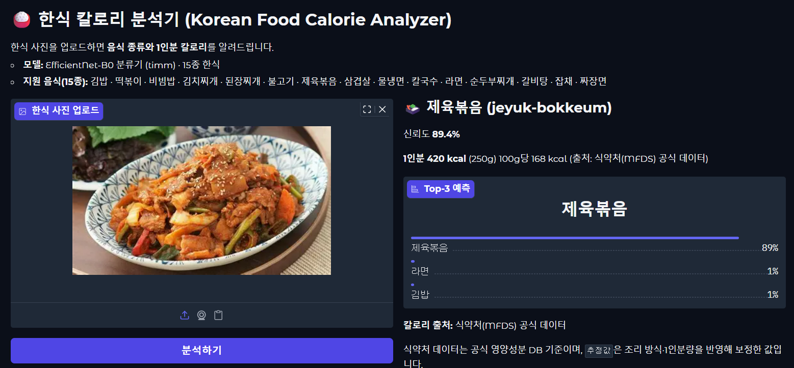
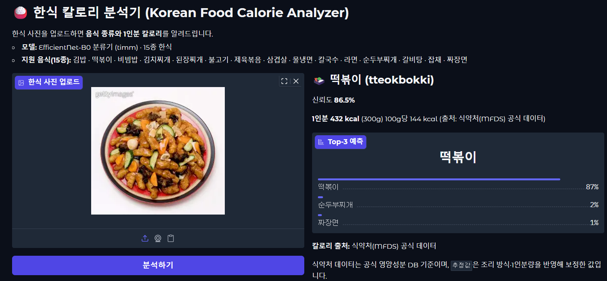
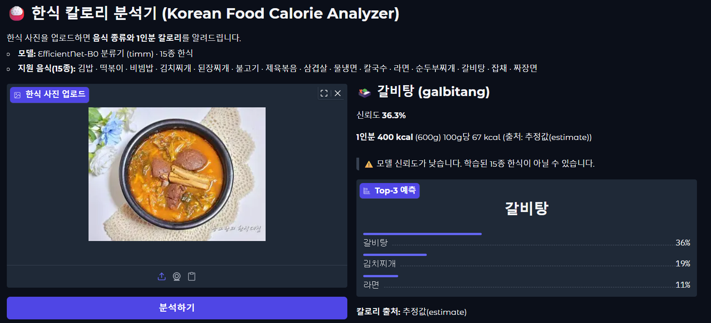
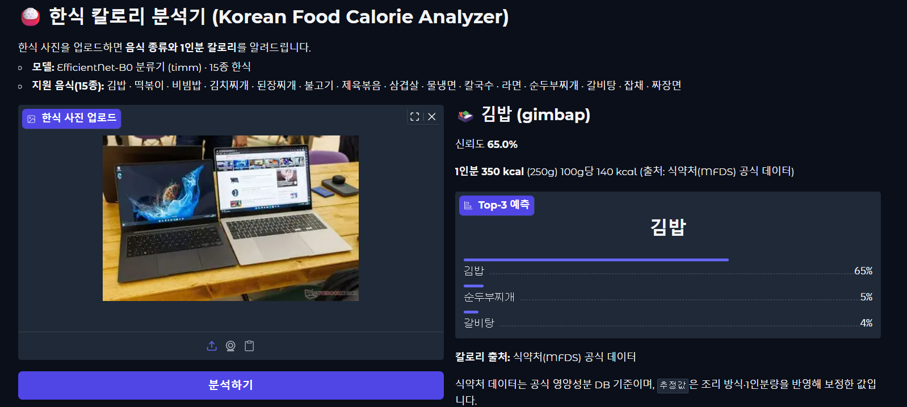
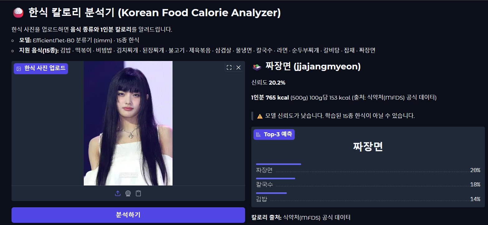
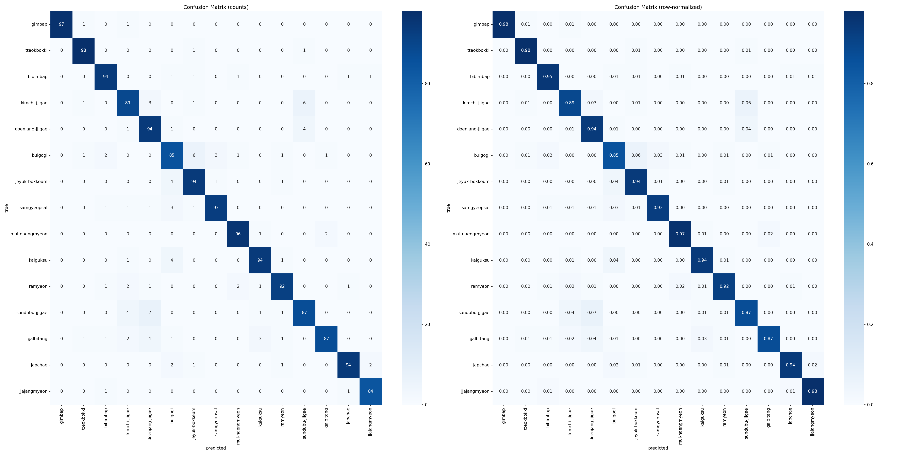

# korean-food-calorie
# 🍱 한식 칼로리 분석기 (Korean Food Calorie Analyzer)

🔗 **라이브 데모: [Hugging Face Spaces](https://huggingface.co/spaces/Happy623623/korean-food-calorie)**

한국 음식 사진에서 음식을 찾아 종류를 알아내고 칼로리를 추정하는 **하이브리드 딥러닝 파이프라인**.

```
이미지 ─▶ [1단계] YOLO11 검출 ─▶ 음식 영역 bbox
                                  │ 각 bbox 크롭
                                  ▼
            [2단계] EfficientNet-B0 분류 ─▶ 음식 종류(23종) + 확신도
                                  │ 검출 박스 1개 = 1인분
                                  ▼
                  kcal_per_serving 합산 ─▶ 음식별 kcal + 총 칼로리
```

## 왜 하이브리드인가

검출(localization)과 분류(classification)를 **한 모델에 모두 맡기지 않고 분리**했다.

- **YOLO11 (검출)** — 한 접시 위 여러 음식의 *위치*를 잡는 데 집중한다. 단일 클래스(`food`)만
  검출하므로 라벨링이 단순하고("음식이면 박스"), 종류 라벨 없이도 검출기를 학습할 수 있다.
- **EfficientNet-B0 (분류)** — 잘라낸 크롭 한 장을 23종 중 하나로 분류한다. 미세한 종류 구분이라는
  더 어려운 일에만 집중하므로, 폴더 기반 분류 데이터(`<class>/*.jpg`)로 쉽게 학습/교체할 수 있다.

각 단계를 독립적으로 학습·교체·평가할 수 있어 유지보수와 디버깅이 쉽다.
칼로리는 **검출된 박스 1개를 표준 1인분으로 보고** `kcal_per_serving` 을 합산한다(별도 양 회귀 없음).

> **단일 진실 공급원:** 클래스 인덱스(0~22)·이름·칼로리는 모두 `food_calories.json` 이 정한다.
> JSON 의 항목 순서 = 클래스 인덱스이고, 분류 데이터 폴더 이름은 각 항목의 영문명(`english`)을 쓴다.
> 분류기 체크포인트에 클래스 순서를 함께 저장해, 추론 시 정렬 불일치를 자동 검증한다.

## 음식 23종

**기존 한식 15종**
김밥 · 떡볶이 · 비빔밥 · 김치찌개 · 된장찌개 · 불고기 · 제육볶음 · 삼겹살 · 물냉면 · 칼국수 · 라면 · 순두부찌개 · 갈비탕 · 잡채 · 짜장면

**신규 확장 8종**
짬뽕 · 달걀프라이 · 피자 · 소세지 · 햄버거 · 스파게티 · 돈까스 · 밥

## 칼로리 매핑 데이터

본 프로젝트는 23종 음식의 1인분 평균 칼로리를 다음과 같이 매핑합니다.

### 데이터 출처

- **식품의약품안전처 식품영양성분 통합 DB** (https://various.foodsafetykorea.go.kr/nutrient/)
- 13개 항목은 식약처 공식 100g당 kcal × 1인분 무게로 계산 (`source: "MFDS"`)
- 10개 항목은 식약처 값에 조정 사유가 있거나 한식 DB에 없어 보정 (`source: "estimate"`)
- 신규 8종 중 식약처 DB에서 조회된 4종(달걀프라이·소세지·돈까스·밥)은 공식값으로 검증/갱신했고, 짬뽕은 조회됐으나 국물 위주 측정값이라 보정, 한식 DB에 없는 양식 3종(피자·햄버거·스파게티)도 추정값을 유지했습니다.

### 보정 사유 (투명성)

| 음식 | 식약처 기준값 | 보정값 | 사유 |
|------|------------|--------|------|
| 갈비탕 | 198 kcal (33/100g × 600g) | 400 kcal | 식약처 값은 국물 위주 측정, 실제 1인분에 포함된 고기/국수 반영 |
| 삼겹살 | 934 kcal (467/100g × 200g) | 520 kcal | 식약처는 생고기 기준, 굽는 과정의 지방 감소 반영 |
| 라면 | 930 kcal (169/100g × 550g) | 500 kcal | 식약처 무게는 국물 포함, 일반 시판 라면 1봉지 기준 |
| 순두부찌개 | 100 kcal (25/100g × 400g) | 250 kcal | 식약처 값이 일반 식당 1인분 대비 낮음 |
| 칼국수 | 679 kcal (97/100g × 700g) | 480 kcal | 일반 참고값 대비 보수적 조정 |
| 불고기 | - | 430 kcal | 식약처에 "돼지불고기"만 등록, 일반적 의미의 소불고기 추정값 사용 |
| 짬뽕 | 406 kcal (58/100g × 700g) | 540 kcal | 식약처 값은 국물 위주 측정, 1그릇 체감 대비 낮아 보정 |
| 피자 | - | 265 kcal | 양식 — 식약처 한식 DB 미수록, 1조각 기준 일반 참고값 |
| 햄버거 | - | 500 kcal | 양식 — 식약처 한식 DB 미수록, 종류별 편차 큼 |
| 스파게티 | - | 560 kcal | 양식 — 식약처 한식 DB 미수록, 토마토·크림 따라 차이 |

각 항목은 `food_calories.json`의 `source`, `note` 필드에서 확인 가능합니다.

### 한계

- 1인분 평균 기준의 고정값 매핑이며, 실제 사진의 음식 양에 따른 정밀한 portion 추정은 수행하지 않습니다.
- 향후 개선 사항: depth estimation 또는 segmentation 기반 부피 추정으로 정확도 향상 가능.

## 데이터셋 분석

분류기(2단계)는 두 소스를 합쳐 **23종 · 총 19,096장**으로 구성했고, train:val:test = **8:1:1** 로 분할했습니다(test ≈ 1,917장).

- **AI Hub 한국 음식 데이터셋 18종** — 기존 한식 15종 + 신규 3종(짬뽕·달걀프라이·밥)
- **UEC FOOD-256 5종** — 한식 DB에 없는 양식/혼합 음식(피자·소세지·햄버거·스파게티·돈까스). 데이터셋의 bbox 라벨로 음식 영역만 크롭하여 사용

클래스별 이미지 수 편차가 커서(최다:최소 ≈ **8:1**) 학습 단계에서 clamp(max=3) 역빈도 클래스 가중치로 보정합니다(아래 [학습 결과](#학습-결과) 참고).

### 1단계 검출기 데이터 (AI Hub 한식 15종)

객체 탐지(YOLO11n)는 AI Hub 한식 15종 중 bbox 라벨이 있는 이미지로 별도 학습합니다. 라벨 가용성이 클래스마다 달라 분포가 불균형합니다.

| 음식 | 이미지 수 | YOLO 라벨 수 | 라벨 비율 |
|------|---------|------------|---------|
| 제육볶음 | 997 | 997 | 100.0% |
| 떡볶이 | 992 | 706 | 71.2% |
| 잡채 | 1,000 | 662 | 66.2% |
| 비빔밥 | 989 | 602 | 60.9% |
| 물냉면 | 988 | 517 | 52.3% |
| 김밥 | 986 | 393 | 39.9% |
| 칼국수 | 997 | 371 | 37.2% |
| 갈비탕 | 1,000 | 348 | 34.8% |
| 삼겹살 | 994 | 340 | 34.2% |
| 불고기 | 999 | 333 | 33.3% |
| 짜장면 | 858 | 245 | 28.6% |
| 순두부찌개 | 999 | 152 | 15.2% |
| 된장찌개 | 998 | 107 | 10.7% |
| 김치찌개 | 996 | 96 | 9.6% |
| 라면 | 997 | 53 | 5.3% |
| **합계** | **14,790** | **5,922** | **40.0%** |

### 데이터 활용 전략

- **분류기 (EfficientNet-B0)**: AI Hub 18종 + UEC 5종 = **19,096장** (8:1:1 분할)
- **객체 탐지 (YOLO11n)**: AI Hub 한식 15종 중 라벨이 있는 **5,922장**만 사용

라벨 분포 불균형으로 인해 YOLO 모델은 라벨 풍부한 클래스(제육볶음, 떡볶이 등)에서 성능이 높고, 라벨 부족 클래스(라면, 김치찌개)에서는 성능 저하가 예상됩니다.

## 🎯 데모

웹에서 한식 사진을 업로드하면 즉시 음식 종류와 1인분 칼로리를 분석합니다.

### 실행 방법

```bash
# 1. 의존성 설치
pip install -r requirements.txt

# 2. 학습된 체크포인트를 checkpoints/best_efficientnet_b0_23.pt 에 배치

# 3. 데모 실행
python app.py

# 브라우저에서 http://127.0.0.1:7860 접속
```

### 1. 학습된 한식 분류 — 정상 동작

학습된 23종 음식은 높은 신뢰도로 분류됩니다. 시각적으로 유사한 음식 간 혼동은 Top-3 예측으로 함께 표시합니다.





→ 김치찌개의 경우 Top-3에 다른 찌개류가 함께 표시되어 모델의 혼동 패턴이 드러납니다. (혼동행렬 분석과 일치)

### 2. 학습되지 않은 음식 — 모델의 한계 가시화

분류기는 학습된 23개 클래스 중에서만 답을 고르도록 설계된 closed-set 모델입니다. 학습 데이터에 없는 음식이 입력되면 가장 비주얼이 유사한 학습 클래스로 분류되는데, 신뢰도 표시를 통해 사용자가 결과를 검증할 수 있도록 했습니다.

**케이스 A: 확신 있는 오답 (신뢰도가 높지만 학습되지 않은 음식)**



탕수육 → **떡볶이 87%**로 분류. 빨간 소스와 덩어리 형태가 떡볶이와 시각적으로 유사하여 모델이 자신 있게 잘못된 결정을 내립니다. 신뢰도 기반 필터링만으로는 이런 경우를 거를 수 없어, 향후 **out-of-distribution 검출** 같은 별도 메커니즘이 필요함을 시사합니다.

**케이스 B: 확신 없는 오답 (신뢰도가 낮아 경고 작동)**



선지국 → **갈비탕 36%**로 분류. 신뢰도 50% 미만으로 저신뢰도 경고가 표시되어 사용자가 결과를 신뢰하지 않도록 유도합니다.

### 3. 음식이 아닌 이미지 — 저신뢰도 경고

음식이 아닌 객체(노트북, 사람 등)도 분류기가 어떤 클래스로 매핑하지만, 저신뢰도 경고를 통해 사용자에게 결과 신뢰성을 알립니다.





### 주요 기능

- **Top-3 예측 시각화**: 막대 그래프로 모델의 후보 클래스 분포를 표시
- **칼로리 출처 명시**: 식약처 공식값(MFDS) vs 보정값(estimate) 구분
- **저신뢰도 경고**: 신뢰도 50% 미만일 때 사용자에게 알림
- **예제 이미지 자동 로딩**: test 폴더에서 6종 자동 수집, 클릭 즉시 분석

### 향후 개선 방향

- **Out-of-distribution 검출**: 탕수육 사례처럼 학습되지 않은 음식을 높은 신뢰도로 오분류하는 한계를 해결
- **다중 음식 검출(YOLO)**: 현재는 사진에 한 음식만 있다고 가정. 식판 사진 등 다중 객체 지원
- **포션 추정**: 현재는 1인분 평균 칼로리만 제공. 실제 사진의 음식 양에 따른 정확한 칼로리 추정

## 학습 결과

> 학습은 **Google Colab(T4 GPU)** 에서 수행했으며, 저장소의 `src/classifier/train.py` 는 동일한 학습 레시피(클래스 가중치·증강·옵티마이저)를 그대로 구현합니다.

### 성능 요약
| 지표 | 값 |
|------|---|
| Test Accuracy | **91.71%** |
| Test 샘플 수 | 1,917장 |
| Macro F1 | 0.913 |

23종 확장 모델의 test 정확도는 **91.7%** (macro F1 0.913). 기존 15종 모델(**92.9%**) 대비 약 1.2%p 하락했는데, 표본이 작고 촬영 도메인이 다른 양식 클래스(UEC FOOD-256)를 추가한 점을 고려하면 합리적인 수준입니다.

### 클래스 불균형 처리

클래스별 이미지 수가 최대 **8배** 차이 나, 다음 세 가지로 보정했습니다.

- **clamp(max=3) balanced 클래스 가중치** — train split 역빈도 가중치를 3.0 으로 상한 (소수 클래스 과대 가중 방지)
- **데이터 증강** — RandomResizedCrop(scale 0.7~1.0) · HorizontalFlip · Rotation(±15) · ColorJitter(0.2/0.2/0.2/0.05)
- **label smoothing 0.1**

### 신규 클래스 성능 (F1)

| 클래스 | F1 | test 표본 |
|--------|----|----------|
| donkkaseu(돈까스) | **1.000** | 14 |
| pizza(피자) | 0.975 | 100 |
| fried-egg(달걀프라이) | 0.961 | 101 |
| rice(밥) | 0.960 | 62 |
| hamburger(햄버거) | 0.909 | 24 |
| jjamppong(짬뽕) | 0.893 | 100 |
| spaghetti(스파게티) | 0.842 | 16 |
| sausage(소세지) | **0.769** | 12 |

신규 8종 F1 은 donkkaseu **1.000** 부터 sausage **0.769** 까지 분포합니다.

### 한계 (정직한 기술)

- **소표본 클래스의 지표 분산**: sausage(test 12장)·spaghetti(16장)·hamburger(24장)는 표본이 작아 F1 이 정·오답 몇 장에 크게 흔들립니다. 절대 수치보다 경향으로 해석해야 합니다.
- **소수 클래스 과대예측 경향**: 클래스 가중치로 소수 클래스 recall 은 끌어올렸지만, 그만큼 해당 클래스로 과대예측(false positive)하는 경향이 남아 있습니다.
- **도메인 혼합**: UEC FOOD-256 출처 양식 클래스는 AI Hub 한식과 촬영·구도 도메인이 달라, 실제 한식 사진 입력 시 분포 차이가 성능에 영향을 줄 수 있습니다.

### 혼동행렬


### 오분류 패턴 분석

대부분의 오분류가 **시각적으로 합리적인 혼동**으로 모델의 학습 품질을 시사:

**1. 찌개 클러스터** (kimchi/doenjang/sundubu)
- 세 찌개 간 양방향 혼동이 가장 빈번
- 붉은 국물 + 두부/김치/된장 등 시각적 특징이 유사

**2. 양념 고기 페어** (bulgogi ↔ jeyuk-bokkeum)
- 빨간 양념과 고기 단면 비주얼이 유사

**3. 국물 + 면 클러스터** (galbitang ↔ kalguksu)
- 흰 국물과 면이 화면에서 비슷한 영역을 차지

**4. 흥미로운 발견** 
- `samgyeopsal → kimchi-jjigae` 오분류는 한국 음식의 자주 등장 조합(삼겹살에 김치) 때문에 모델이 학습한 공기 패턴

### 클래스별 성능 (F1 기준, 전체 23종)
| 상위 | 하위 |
|------|------|
| donkkaseu 1.000 | sausage 0.769 |
| pizza 0.975 | sundubu-jjigae 0.834 |
| jjajangmyeon 0.972 | spaghetti 0.842 |

시각적 특징이 독특한 음식(돈까스, 피자, 짜장면)은 거의 완벽 분류.  
유사 비주얼 음식(찌개류, 양념고기)과 소표본 양식 클래스에서 성능 저하.

### 개선 방향
1. **찌개류/양념고기 fine-grained augmentation**: 색상 hue/saturation 변형 강화
2. **소표본 양식 클래스 데이터 보강**: sausage·spaghetti·hamburger 의 test 표본 확대로 지표 안정화
3. **추가 정규화**: dropout 0.2 → 0.3, mixup α=0.2

## 설치

```bash
pip install -r requirements.txt
```

## 디렉터리 구조

```
korean-food-calorie/
├── infer.py                     # 추론 CLI 진입점
├── food_calories.json           # 클래스/칼로리 단일 진실 공급원 (23종)
├── configs/
│   ├── detector.yaml            # 1단계 YOLO 검출기 설정
│   └── classifier.yaml          # 2단계 분류기 설정
├── src/
│   ├── detector/                # 1단계: 음식 영역 검출 (YOLO11)
│   │   ├── train_yolo.py        #   학습 + dataset.yaml 자동 생성
│   │   └── inference_yolo.py    #   박스 추론 (FoodDetector)
│   ├── classifier/              # 2단계: 음식 23종 분류 (EfficientNet-B0)
│   │   ├── dataset.py           #   폴더 기반 Dataset + albumentations
│   │   ├── model.py             #   torchvision EfficientNet-B0 분류기
│   │   └── train.py             #   AdamW · CosineAnnealing · AMP · best.pt
│   ├── pipeline.py              # 검출→crop→분류→kcal 합산 (FoodCaloriePipeline)
│   └── utils.py                 # 시드/설정/로깅/체크포인트 + FoodTable
└── data/
    ├── detector/                # YOLO 검출 학습 데이터
    │   ├── images/{train,val,test}/
    │   └── labels/{train,val,test}/
    └── classifier/              # 폴더 기반 분류 학습 데이터
        ├── train/<english_name>/*.jpg
        └── val/<english_name>/*.jpg
```

## 데이터 준비

### 1단계 — 검출기 (YOLO 형식, 단일 클래스 `food`)

이미지와 라벨을 같은 파일명으로 1:1 배치한다.

```
data/detector/
  images/{train,val,test}/  *.jpg
  labels/{train,val,test}/  *.txt
```

라벨(`.txt`) 한 줄 — 모두 0~1 정규화, 단일 클래스이므로 `class_id` 는 항상 `0`:

```
0 <center_x> <center_y> <width> <height>
```

### 2단계 — 분류기 (폴더 기반)

음식 종류별 폴더(영문명)에 크롭 이미지를 담는다. 폴더 이름은 `food_calories.json` 의 `english` 와 일치시킨다.

```
data/classifier/
  train/
    gimbap/ *.jpg
    tteokbokki/ *.jpg
    bibimbap/ *.jpg
    ...
  val/
    gimbap/ *.jpg
    ...
```

> 분류용 크롭은 검출기 학습 라벨에서 bbox 를 잘라 만들거나, AI Hub 등 한국 음식 데이터셋의
> 종류별 이미지를 위 폴더 구조로 배치해 확보한다.

## 학습

```bash
# 1단계: 음식 영역 검출기 (configs/classes 로부터 dataset.yaml 자동 생성)
python -m src.detector.train_yolo --config configs/detector.yaml

# 2단계: 음식 23종 분류기 (AdamW + CosineAnnealing + AMP, best.pt 저장)
python -m src.classifier.train --config configs/classifier.yaml
```

- 검출기: COCO 사전학습 `yolo11s.pt` 에서 fine-tuning, 완료 후 best.pt 를
  `configs/detector.yaml` 의 `model.weights`(기본 `checkpoints/yolo11_food.pt`)로 복사.
- 분류기: ImageNet 사전학습 EfficientNet-B0 에서 fine-tuning, 검증 top-1 정확도 최고 시점을
  `configs/classifier.yaml` 의 `train.weights`(기본 `checkpoints/classifier_best.pt`)로 저장.

## 추론

```bash
# 결과(JSON) 출력
python infer.py --source path/to/food.jpg

# 박스가 그려진 이미지로 저장
python infer.py --source path/to/food.jpg --save outputs/annotated.jpg

# 폴더 일괄 처리
python infer.py --source path/to/folder/
```

출력 예:

```json
{
  "detections": [
    {
      "class_id": 2,
      "name": "비빔밥",
      "english": "bibimbap",
      "detect_conf": 0.91,
      "class_prob": 0.97,
      "bbox_xyxy": [34.0, 50.5, 410.2, 380.0],
      "kcal": 600.0,
      "grams": 450.0
    }
  ],
  "total_kcal": 600.0,
  "num_items": 1,
  "image_shape": [480, 640]
}
```

- `detect_conf` : 1단계 YOLO 의 음식 검출 신뢰도
- `class_prob`  : 2단계 분류기의 종류 확신도(softmax)
- `kcal`        : 해당 음식 1인분 평균 칼로리 (`food_calories.json`)

## 기술 스택

PyTorch · Ultralytics YOLO11 · torchvision (EfficientNet-B0) · albumentations · OpenCV
